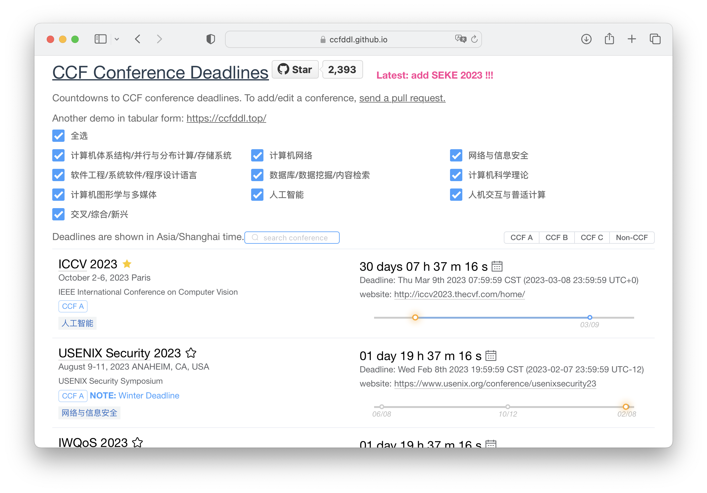

# CCF-Deadlines

[](https://github.com/ccfddl/ccf-deadlines/blob/main/LICENSE)

简体中文 | [English](./README.md)

帮助计算机类科研人员追踪[中国计算机学会 (CCF)](https://www.ccf.org.cn/)推荐国际学术会议的截稿日期。

在线预览: [演示页面](https://taiddl.github.io/)

[]()

**对麻烦的查找会议和转换时间说拜拜!**

提示: 可检查 [会议推荐目录](.readme_assets/ccf_recommended_2022.pdf)
和 [统计表格](https://docs.qq.com/sheet/DR3F1Tm1jcnlzVFJ2)

## 会议录入文件

示例文件: conference/DB/sigmod.yml

```
- title: SIGMOD
  description: ACM Conference on Management of Data
  sub: DB
  rank: A
  dblp: sigmod
  confs:
    - year: 2022
      id: sigmod22
      link: http://2022.sigmod.org/
      timeline:
        - deadline: '2021-07-02 17:00:00'
          comment: 'first round'
        - deadline: '2021-09-15 17:00:00'
          comment: 'second round'
      timezone: UTC-8
      date: June 12-17, 2022
      place: Philadelphia, PA, USA
```

字段描述:

<table>
   <tr>
      <th colspan="3">字段名</th>
      <th>描述</th>
   </tr>
   <tr>
      <td colspan="3"><code>title</code>*</td>
      <td>缩写的会议名称, 不需要年份, 大写</td>
   </tr>
   <tr>
      <td colspan="3"><code>description</code>*</td>
      <td>介绍, 或全称, 无需第几届</td>
   </tr>
   <tr>
      <td colspan="3"><code>sub</code>*</td>
      <td>会议在CCF中被标注的类别, 可参考下面的辅助文档</td>
   </tr>
   <tr>
      <td colspan="3"><code>rank</code>*</td>
      <td>会议在CCF中被标注的等级, 示例, <code>A</code>, <code>B</code>, <code>C</code></td>
   </tr>
   <tr>
      <td colspan="3"><code>dblp</code>*</td>
      <td>会议在dblp的URL的后缀, 示例, <code>iccv</code> in https://dblp.uni-trier.de/db/conf/iccv</td>
   </tr>
   <tr>
      <td rowspan="9"><code>confs</code></td>
      <td colspan="2"><code>year</code>*</td>
      <td>会议的年份</td>
   </tr>
   <tr>
      <td colspan="2"><code>id</code>*</td>
      <td>会议名字和年份, 小写</td>
   </tr>
   <tr>
      <td colspan="2"><code>link</code>*</td>
      <td>会议首页的URL</td>
   </tr>
   <tr>
      <td rowspan="3"><code>timeline</code>*</td>
      <td><code>abstract_deadline</code></td>
      <td>Abstract的截稿日期, 可选填</td>
   </tr>
   <tr>
      <td><code>deadline</code>*</td>
      <td>截稿日期, 格式为 <code>yyyy-mm-dd hh:mm:ss</code> or <code>TBD</code></td>
   </tr>
   <tr>
      <td><code>comment</code></td>
      <td>额外的一些辅助信息, 可选填</td>
   </tr>
   <tr>
      <td colspan="2"><code>timezone</code>*</td>
      <td>截稿日期的时区, 目前支持 <code>UTC-12</code> ~ <code>UTC+12</code> & <code>AoE</code></td>
   </tr>
   <tr>
      <td colspan="2"><code>date</code>*</td>
      <td>会议举办的日期, 示例, Mar 12-16, 2021</td>
   </tr>
   <tr>
      <td colspan="2"><code>place</code>*</td>
      <td>会议举办的地点, 示例, <code>city, country</code></td>
   </tr>
</table>

带星标(*)的字段是必填项。

类别匹配表:

| `sub` | 类别名称                 |
|-------|----------------------|
| `DS`  | 计算机体系结构/并行与分布计算/存储系统 |
| `NW`  | 计算机网络                |
| `SC`  | 网络与信息安全              |
| `SE`  | 软件工程/系统软件/程序设计语言     |
| `DB`  | 数据库/数据挖掘/内容检索        |
| `CT`  | 计算机科学理论              |
| `CG`  | 计算机图形学与多媒体           |
| `AI`  | 人工智能                 |
| `HI`  | 人机交互与普适计算            |
| `MX`  | 交叉/综合/新兴             |

灵感来自于 [ccf-deadlines](https://ccfddl.github.io//)。

## License

MIT